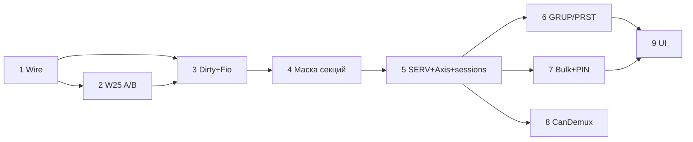

# План реализации консоль ↔ сервер (финальный)

Опора: [`SYSTEM.md`](SYSTEM.md), [`ANALYSIS.md`](ANALYSIS.md), [`PROTOCOL.md`](PROTOCOL.md).

**Файл плана:** `PUMS/Console/src/smcp/IMPLEMENTATION.md`

Принцип: от простого к сложному; одна фаза → собирается → можно PR.  
Цель кода: универсальный multi-seg движок пульта (группы + пресеты); продукт (PUMS UI) и будущий слой **cue** — снаружи.

---

## Модель (не ломаем)

```text
Show (SERV / GRUP / PRST / SETT)
SegmentBank → Segment → Axis (CMech-like: config* + live)
Group / Preset = SectionPool, wire-слоты
MConsole = composition root (банки, Fio, сессии, хуки)
UI = жесты / paint / uiMessages (без пользовательских строк в модели)
Cue = позже, над PRST
```

Фасад «все жесты на MConsole» **не делаем**. Примитивы на Axis/Group/Preset; PUMS UI сам собирает toggle.

---

## Фаза 0 — дизайн (готово)

- [x] Решения A–H, storage-split, multi-byte, PIN, Absolute/Relative, ShowBlob B  
- [x] `SYSTEM.md`, `ANALYSIS.md`

---

## Фаза 1 — wire / типы

| # | Задача |
|---|--------|
| 1.1 | `MotionTarget`: signed, единицы kind, **Absolute \| Relative**; убрать `_mm` из имён |
| 1.2 | `ResetFault` `0x22` + pack/unpack + stub TX/RX |
| 1.3 | Enum stubs `0x30–0x39` + `ServiceUnlock`; demux no-op / Nack |
| 1.4 | `PROTOCOL.md` — роли новых MsgId |

---

## Фаза 2 — W25 A/B

| # | Задача |
|---|--------|
| 2.1 | `W25qShowFile`: 2 сектора, seq+magic/CRC, ping-pong |
| 2.2 | Снаружи тот же `IFile` (Fio не знает A/B) |
| 2.3 | Проверка: обрыв на inactive не убивает active |

---

## Фаза 3 — dirty + политика Fio/носители

| # | Задача |
|---|--------|
| 3.1 | Dirty на секцию/пул; `*` = any dirty |
| 3.2 | bak = W25; bad SD → не писать bak, restore с bak |
| 3.3 | Нет SD → Save только bak + флаг «только W25Q» |
| 3.4 | После SD-save → sync bak |

---

## Фаза 4 — маска секций Fio

| # | Задача |
|---|--------|
| 4.1 | Load/save по маске секций (API; UI чекбоксы в фазе 9) |
| 4.2 | Нет SERV в live → отказ грузить только шоу-секции |
| 4.3 | Overflow → статус/callback (без тихого truncate) |
| 4.4 | A2: mismatch seg → warning + disarm API |

---

## Фаза 5 — SERV, слоты, сессии

| # | Задача |
|---|--------|
| 5.1 | Влить MechConfig |
| 5.2 | Секция SERV (SegHdr name + MechConfig) |
| 5.3 | Segment / Axis: слоты из SERV; убрать `storage(server_id)` на консоли |
| 5.4 | Gaps mech_id; маска 32 vs capacity inventory |
| 5.5 | `MaxSessions ≥ MaxSeg`; `start` на каждый server_id |
| 5.6 | console_id из NVM до `begin` |

---

## Фаза 6 — группы и пресеты

| # | Задача |
|---|--------|
| 6.1 | GRUP: `(seg_id, Selection)`; local-test `group_pool` не в leaf |
| 6.2 | SETT: номер группы «текущего шоу» + API фильтра клеток |
| 6.3 | PRST: `{ seg_id, Selection, MotionTarget }` + overlap на record/load |
| 6.4 | Recall: все Select→Ack → SetTarget; Atomic → rollback |

---

## Фаза 7 — multi-byte config + PIN

| # | Задача |
|---|--------|
| 7.1 | GetConfigHash / ConfigHash / ConfigHashChanged |
| 7.2 | Формат blob SERV на проводе + GetConfig/chunk pull + CRC |
| 7.3 | ServiceUnlock + PutConfig*; PIN hash на сервере |
| 7.4 | Apply SERV: смена kind → warn/disarm |
| 7.5 | Зарезервировать `type=ShowBlob` (UI sync — later) |

---

## Фаза 8 — сервер CanDemux

| # | Задача |
|---|--------|
| 8.1 | CanDemux: 1 ICAN → 2 Node |
| 8.2 | Два logical server_id/seg; jack→seg |
| 8.3 | Паспорта + hash на сервере; привод только внутри сервера |

---

## Фаза 9 — UI продукта (PUMS)

| # | Задача |
|---|--------|
| 9.1 | Чекбоксы секций load/save |
| 9.2 | MsgBox: overflow, config mismatch, offer SD |
| 9.3 | Фильтр «только группа шоу» |
| 9.4 | Контекст/страницы seg |
| 9.5 | E-Stop release → ResetFault |

---

## Зависимости



**Старт:** фаза 1.

---

## Вне плана

| Что | Когда |
|-----|--------|
| Cue поверх PRST | большие консоли |
| Юзеры пульта (Operator/Editor/Admin) | после прода |
| Live collaborative sync шоу | над ShowBlob |
| Реальный DriveMech / линк к платам | трек сервера |
| FlightObject, шифрование CAN, Block multi-console policy | позже |
| Миграция старых SMCP | не делаем |

---

## Сейчас в коде → станет

| Сейчас | После плана |
|--------|-------------|
| W25 один сектор | A/B в `W25qShowFile` |
| GRUP одна Selection | `(seg, Selection)` |
| `storage(server_id)` | Axis из SERV |
| MaxSessions = 1 | ≥ MaxSeg |
| MotionTarget `*_mm` | kind units + Abs/Rel |
| Нет SERV / bulk / PIN / CanDemux | фазы 5–8 |
