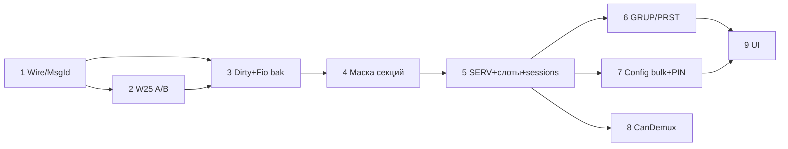

# План реализации консоль ↔ сервер

Опора: `SYSTEM.md`, `ANALYSIS.md`, `PROTOCOL.md`.  
**Сначала согласовать фазы → потом код по одной фазе (PR на фазу или логический коммит).**

Принцип: от изолированного и маленького к связанному и большому. Каждая фаза должна собираться и не ломать уже принятое поведение без явного флага/`#if`.

---

## Фаза 0 — уже сделано (дизайн)

- [x] Решения A–H, storage-split, multi-byte, PIN, Absolute/Relative  
- [x] `SYSTEM.md` для ревью  

---

## Фаза 1 — мелкий wire / типы (без UI, без FIO)

Цель: заложить поля и MsgId, сервер/пульт могут stub’ить.

| # | Задача | Где | Критерий готово |
|---|--------|-----|-----------------|
| 1.1 | `MotionTarget`: signed + **Absolute \| Relative** | `mech.hpp` / pack SetTarget | sizeof/pack согласованы; старые тесты поправить |
| 1.2 | `ResetFault` MsgId `0x22` + pack/unpack | `mech/message.hpp`, Session stub | PDU в таблице PROTOCOL; TX/RX stub Ok/Nack |
| 1.3 | Заготовки MsgId `0x30–0x39` + `ServiceUnlock` (enum + пустые handlers) | message + PROTOCOL | компиляция; demux no-op / Nack NotReady |

**Не делаем в фазе 1:** реальный bulk, PIN, движение привода.

---

## Фаза 2 — W25 A/B (изолированно от Fio логики)

| # | Задача | Критерий |
|---|--------|----------|
| 2.1 | `W25qShowFile`: два сектора, seq+magic/CRC, ping-pong | open читает активный; sync пишет неактивный → commit |
| 2.2 | Сохранить интерфейс `IFile` | Fio по-прежнему видит один bak |
| 2.3 | Smoke: erase/program/power-fail mental test / unit на host если есть mock flash | активный слот переживает «обрыв» на inactive |

---

## Фаза 3 — dirty секций + Fio политика носителей

| # | Задача | Критерий |
|---|--------|----------|
| 3.1 | `markEdited` / dirty **на секцию (пул)** | A6; Show-уровень `*` = any dirty |
| 3.2 | Fio: bak = W25; bad SD load → не писать bak, `restore()` с bak | как SYSTEM §5 |
| 3.3 | Нет SD: Save → только bak + флаг «только W25Q» | UI later или dbg-флаг |
| 3.4 | После SD-save → sync bak | один путь Save |

**Пока без** чекбоксов секций в UI — API маски секций можно ввести внутренне.

---

## Фаза 4 — load/save по маске секций (Fio)

| # | Задача | Критерий |
|---|--------|----------|
| 4.1 | Маска/чекбоксы секций в open/save | A1 |
| 4.2 | Нет SERV в live → отказ грузить только GRUP/PRST/SETT | storage §3 |
| 4.3 | Overflow → статус/callback для MsgBox (A3), без тихого truncate | |
| 4.4 | A2: mismatch seg → warning list + disarm API | UI MsgBox later |

---

## Фаза 5 — SERV + слоты пульта + сессии

| # | Задача | Критерий |
|---|--------|----------|
| 5.1 | Секция SERV (SegHdr name, MechConfig pool) в Show | static layout / SectionPool |
| 5.2 | CMechBank: слоты **из SERV**, убрать `storage(server_id)` на консоли | B1/B2 |
| 5.3 | `MaxSessions ≥ MaxSeg`; `start` на каждый server_id | H2 |
| 5.4 | console_id из NVM до `begin` | E2 (минимум: RTC/W25 ключ) |

---

## Фаза 6 — группы / пресеты wire

| # | Задача | Критерий |
|---|--------|----------|
| 6.1 | GRUP: слоты `(seg_id, Selection)`; убрать опору на local-test bank | C1 |
| 6.2 | SETT: номер «группы текущего шоу» + фильтр API | B5 |
| 6.3 | PRST: `{ seg_id, Selection, MotionTarget }` + overlap check | D1/D3 |
| 6.4 | Recall: все Select→Ack, затем SetTarget; Atomic rollback | D2/C2 |

---

## Фаза 7 — multi-byte config + PIN

| # | Задача | Критерий |
|---|--------|----------|
| 7.1 | GetConfigHash / ConfigHash / ConfigHashChanged | sequence SYSTEM §4 |
| 7.2 | GetConfig + chunk pull + CRC → live SERV | |
| 7.3 | ServiceUnlock + PutConfig* (сервер хранит hash PIN) | |
| 7.4 | При apply SERV: проверка смены `kind` → disarm | §5 |
| 7.5 | `type=ShowBlob` зарезервировать (sync пульт↔пульт — UI later) | вариант B |

---

## Фаза 8 — сервер CanDemux + привязка привода

| # | Задача | Критерий |
|---|--------|----------|
| 8.1 | CanDemux: 1 ICAN → 2 Node | B3/B4 |
| 8.2 | Два logical server_id / seg на шкафу | jack→seg на сервере |
| 8.3 | Drive остаётся за сервером; northbound только SetTarget/Telemetry | E3/E5 |

---

## Фаза 9 — UI / продукт (после модели)

| # | Задача |
|---|--------|
| 9.1 | Чекбоксы секций load/save |
| 9.2 | MsgBox overflow / config mismatch / offer SD |
| 9.3 | Фильтр «только группа шоу» |
| 9.4 | Страницы/контекст seg (PUMS) |
| 9.5 | E-Stop → ResetFault на release |

---

## Порядок зависимости (кратко)

---

## Предлагаемый старт

**Согласовать фазу 1** (MotionTarget Absolute/Relative + ResetFault + enum multi-byte stubs) — маленький diff, сразу полезен для PROTOCOL.

После merge фазы 1 → фаза 2 (W25 A/B).

---

## Вне плана (явно не трогаем)

- Continuous UI/семантика сверх Absolute/Relative + min/max края  
- Юзеры пульта (после прода)  
- Live collaborative sync шоу (C)  
- FlightObject  
- Шифрование CAN  
