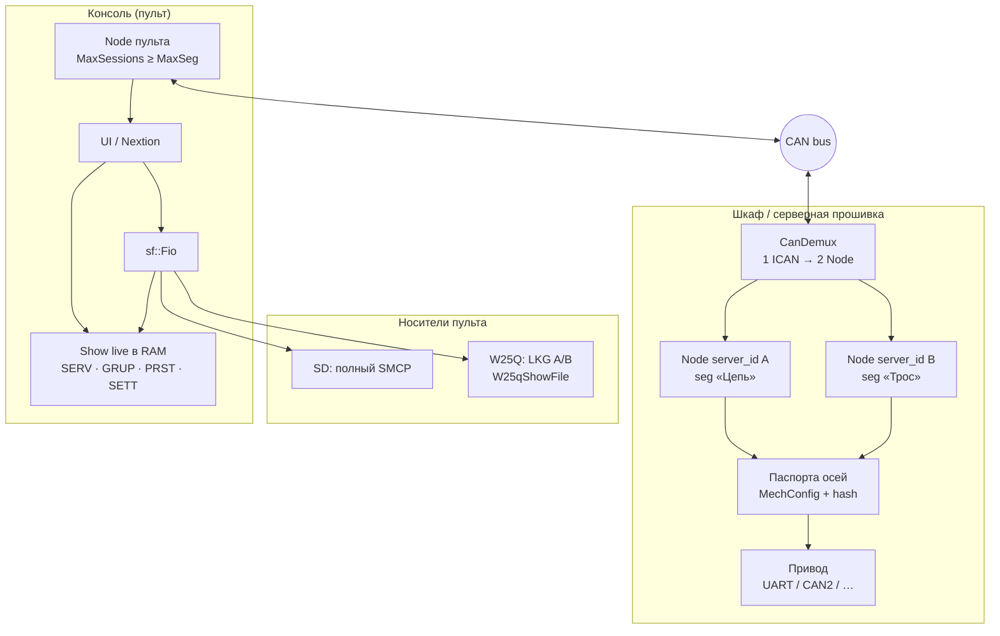
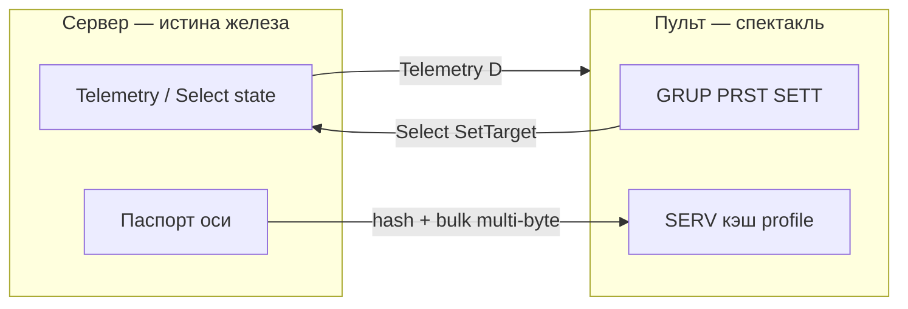
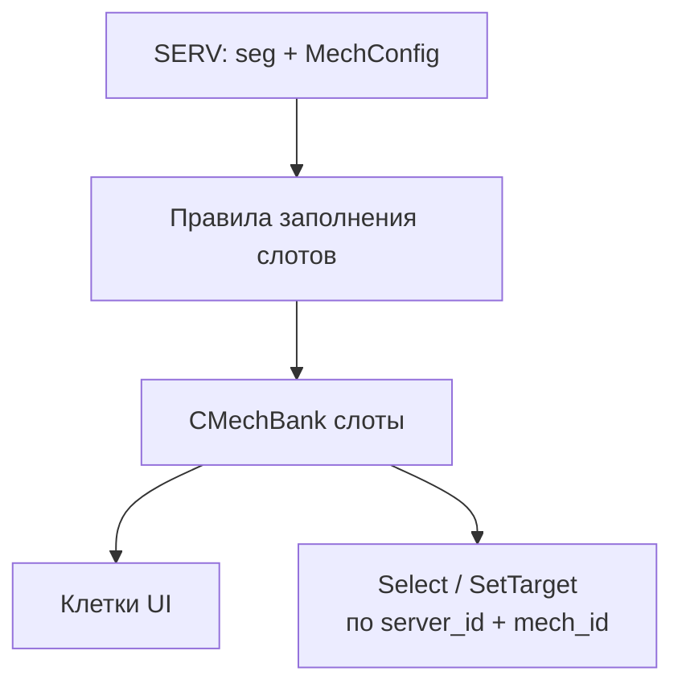
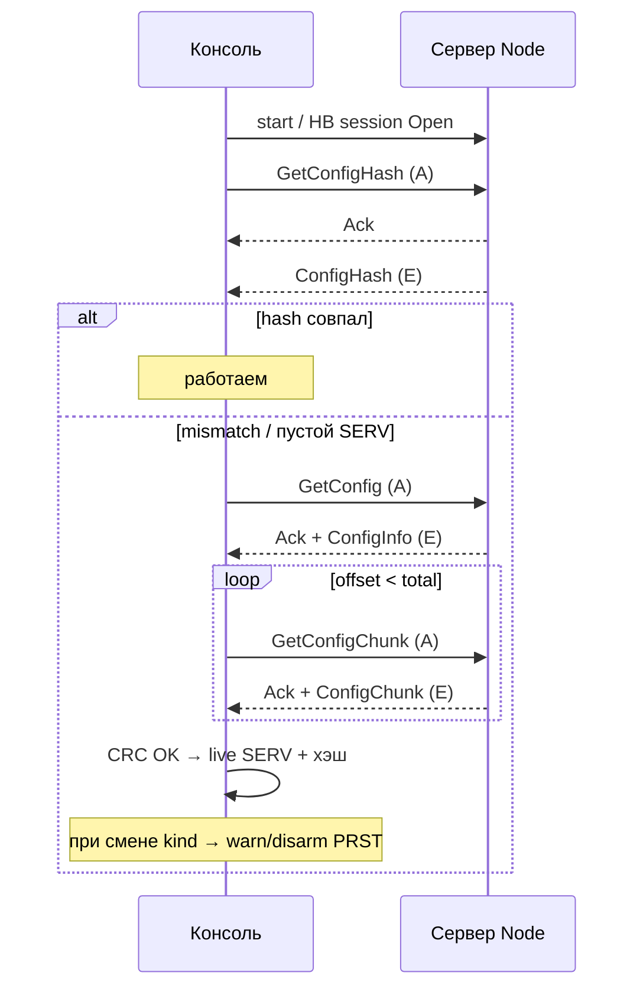
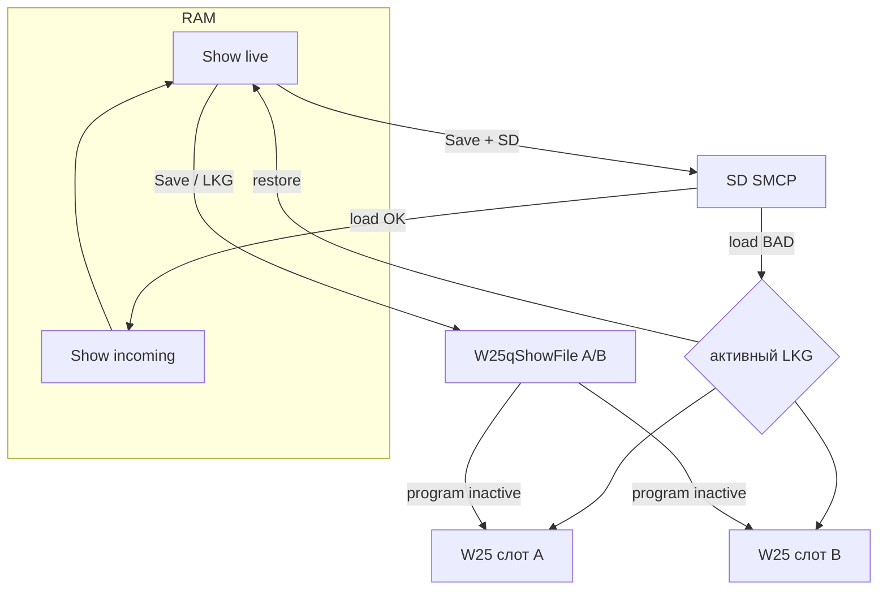
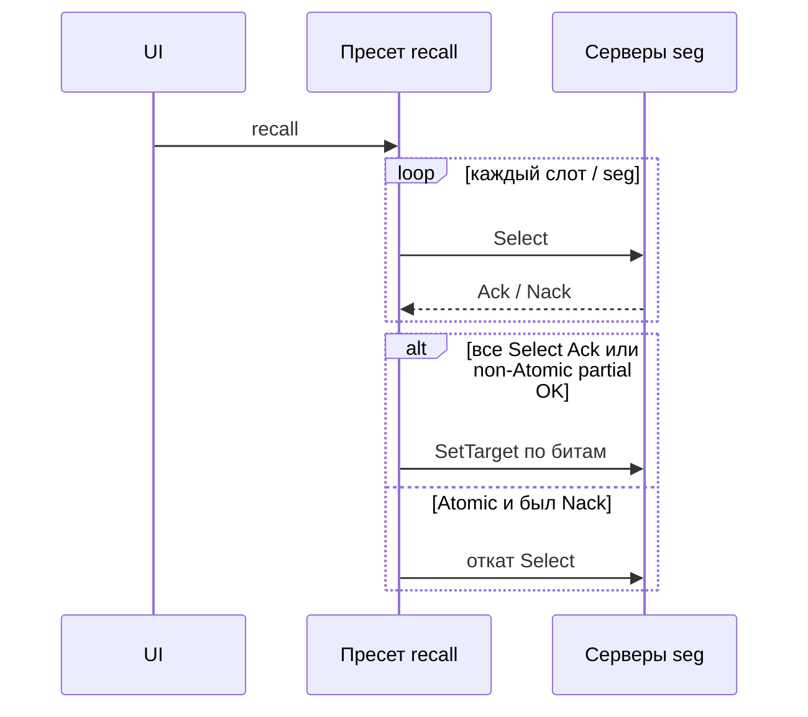
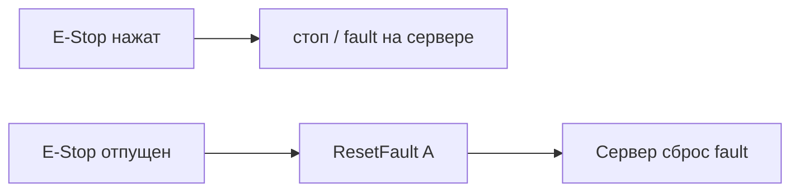

# Консоль ↔ Сервер — логика системы

Документ для проверки принятых решений. Детали дыр и чеклисты — `ANALYSIS.md`. Транспорт кадров — `PROTOCOL.md`.  
План кода (фазы) — [`IMPLEMENTATION.md`](IMPLEMENTATION.md).

---

## 1. Общая картина

Одна **консоль** (пульт) на CAN. На стороне **шкафа** — один физический CAN, в прошивке сервера до **двух logical Node** (например цепь / трос) через **CanDemux**. Привод лебёдок — **внутри сервера** (UART/CAN2/…); пульт этого не видит.

---

## 2. Кто чем владеет

| Данные | Владелец | Где у пульта |
|--------|----------|--------------|
| scale, home, kind, hard limits | **сервер** | кэш в SERV после bulk |
| live: position, holder, block, fault | **сервер → Telemetry** | слоты CMechBank |
| GRUP / PRST / SETT | **шоуфайл / live Show** | RAM + SD/W25 |
| MotionTarget в пресете | пульт хранит, сервер исполняет | PRST |
| console_id | NVM пульта | не в шоу |
| service PIN | **сервер** NVM | UI только вводит |

**Правило файла:** один тип SMCP, load/save **чекбоксами секций**.  
Если в live **нет SERV** — нельзя грузить отдельно только шоу-секции (нужен SERV из файла или bulk с сервера).

---

## 3. Адресация осей на пульте

- Нет `storage(server_id)` / `mech[id]` через ObjRegistry на консоли.
- Есть **CMechBank**: слоты заполняются по **SERV**; слот = live + ссылка на config.
- Gaps `mech_id` разрешены, не уплотняем.
- `MaxSessions ≥ MaxSeg`; `start` на каждый `server_id` из патча.

---

## 4. Подключение и синхронизация паспортов

Без VID/UID. Сверка по **хэшу** настроек сервера; выгрузка — **multi-byte pull** (куски ≤6 B data).

**Смена на сервере online:** broadcast `ConfigHashChanged` → пульты как при mismatch.

**Сервис PutConfig:** PIN на сервере → `ServiceUnlock` на сессию → PutConfig / chunks / Commit → новый hash + broadcast.  
До прода юзеров на пульте нет; после прода — уровни на пульте (не на сервере привода).

---

## 5. Шоуфайл, FIO, W25

- Рабочая копия **всегда в RAM** (`Show` live + staging incoming).
- Flash/SD — сериализованный снимок; указатели на W25 не натягиваем (SPI NOR).
- **A/B** двух секторов W25 — внутри `W25qShowFile`, для Fio это обычный `IFile` bak.
- Bad load с SD → bak не трогаем → restore с W25.
- Нет SD → Save только на W25 («только W25Q»); появилась карта → предложить save на SD.

Dirty — **на секцию/пул**; save = чекбоксы ∩ dirty.

---

## 6. Группы и пресеты

**Группы:** wire-слоты `(seg_id, Selection)`. Partial multi-seg — best-effort + Nack; **Atomic** → откат.  
«Текущее шоу» — **обычная** группа, её номер в SETT; фильтр UI «только используемое».

**Пресеты:** слот `{ seg_id, Selection, MotionTarget }`.  
`MotionTarget`: signed int в единицах `kind` + **Absolute | Relative**.  
Continuous: в паспорте min/max на краях диапазона.

Overlap оси в одном пресете — reject при record и load.  
После смены profile критичен только **`kind`**; home/scale/invert — сервер; нет оси → Nack runtime.

---

## 7. Управление движением и безопасность

| Действие | Поведение |
|----------|-----------|
| Select / Block / SetTarget | короткие PDU как сейчас |
| ResetFault | MsgId после **release** E-Stop |
| Isolate / Спектакль | UI не шлёт лишний Select |
| Клетка Block | сегментный PDU |
| Группа Block | только флаг GRUP |

---

## 8. Multi-byte MsgId (сводка)

| Id | Имя | Класс | Назначение |
|----|-----|-------|------------|
| 0x22 | ResetFault | A | сброс после E-Stop release |
| 0x30–0x36 | GetConfig* / Config* | A/E/D | hash + pull blob |
| 0x37–0x39 | PutConfig* | A | сервисная запись |
| type | ServProfile / **ShowBlob** | | ShowBlob — sync пульт↔пульт (вариант B) |

Select/Telemetry/HB — без multi-byte. Fio в multi-byte не участвует.

---

## 9. Что проверить при ревью

- [ ] Один CAN: консоль видит два peer; CanDemux только на сервере  
- [ ] Паспорт оси не «живёт» только на SD пульта online  
- [ ] Load шоу без SERV в live запрещён  
- [ ] W25 A/B скрыт от Fio; RAM — единственная рабочая копия  
- [ ] Preset: все Select Ack → потом SetTarget; Absolute/Relative в target  
- [ ] PutConfig только после ServiceUnlock (PIN на сервере)  
- [ ] Привод и линк к платам не торчат в northbound  

Расхождения править в `ANALYSIS.md`, затем здесь.
