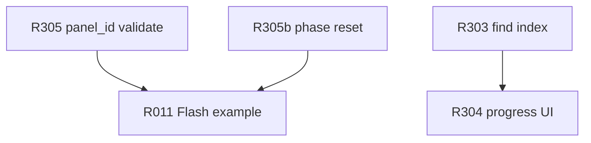

# Nextion — IdMap / Discover backlog

Открытые пункты по **`idmap::Table`**, **`SmartApp::Discover`** и Flash-workflow. Полная история и архитектура: [REFACTORING.md](REFACTORING.md). **SmartApp в release:** [REFACTORING_DEFERRED.md](REFACTORING_DEFERRED.md) (NEX-R201).

**Модули:** `idmap/nexIdMap.*`, `app/nexSmartApp.*`, `Route::kCompIdMapPoll*` в `core/nexTypes.hpp`.

**Легенда:** `[ ]` — к реализации; сложность: S / M / L / XL.

---

## Контекст

**IdMap Discover — не transport layer.** Опрос panel id (`0xFE/0xFE`) идёт через `SmartApp`; таймаут Discover не дублирует `SessionTimeout` в UI. `pollFail` → `onDiscoverComplete(false)`.

В выпускаемой прошивке обычно: `Application` + таблица из Flash (`idMapLoadFromBuffer`); Discover — только на этапе разработки HMI.

---

## Открытые проблемы (аудит)

| Severity | ID | Суть | Где проявляется |
|----------|-----|------|-----------------|
| **Medium** | R305 | `panel_id=0xFF` попадает в таблицу | `upsert` не отклоняет `0xFF`; `applyFromTable` молча пропускает |

---

## Backlog

### [ ] NEX-R303 — Индекс `(page_id, compiled_id)` в `idmap::Table::find`

**Проблема.** `find` — линейный scan O(n) по `records[]`; при Discover с сотнями компонентов — hot path.

**Цель.** Side hash или sorted array + binary search; или fixed `(page<<8|id)` key array для max pages.

| | |
|---|---|
| **Файлы** | `idmap/nexIdMap.hpp/cpp` |
| **Сложность** | M |

---

### [ ] NEX-R304 — Прогресс Discover `(done, total)` для UI boot

**Проблема.** `startDiscover()` async; UI не знает «сколько осталось» — только `isDiscoverBusy()` и финальный `onDiscoverComplete`.

**Как сейчас.** `_page_index`, `_polled`, `discoverComponentCount` — внутренние поля SmartApp.

**Цель.** `discoverProgress()` → `{ done, total }` или callback; total = sum of components across pages.

| | |
|---|---|
| **Файлы** | `app/nexSmartApp.hpp/cpp` |
| **Сложность** | M |

---

### [ ] NEX-R305 — Валидация `panel_id` в IdMap

**Проблема.** `Table::upsert` отклоняет только `panel_id == kPageCompId`. Значение **0xFF** (unassigned) и **0** попадают в таблицу; `applyFromTable` пропускает `0xFF`/`kPageCompId` — silent data loss.

**Цель.** `upsert`: reject `0`, `0xFF`, `kPageCompId`, duplicate `(page, panel_id)`; `discoverOnPollResponse`: fail discover при invalid.

| | |
|---|---|
| **Файлы** | `idmap/nexIdMap.cpp`, `app/nexSmartApp.cpp` |
| **Сложность** | S |

---

### [ ] NEX-R305b — `idMapLoadFromBuffer()`: сброс `_phase` Discover

**Проблема.** Загрузка Flash-блоба вызывает `applyFromTable()`, но если до этого Discover был прерван — `_phase` может остаться не `Idle`/`Done`.

**Цель.** `idMapLoadFromBuffer` → `_phase = Done` или `Idle`, `_mode = Flash`, stop timers.

| | |
|---|---|
| **Файлы** | `app/nexSmartApp.cpp` |
| **Сложность** | S |

---

### [ ] NEX-R305c — Discover: `ObjRegistry::next()` вместо scan `1…255`

**Проблема.** `discoverAdvanceCompId` инкрементирует `_scan_id` 1…255 и проверяет `discoverHasComponent` — O(255) на страницу даже для 3 компонентов.

**Цель.** Итератор registry: только реально зарегистрированные compiled id; быстрее boot на больших HMI.

| | |
|---|---|
| **Файлы** | `app/nexSmartApp.cpp`, `comp/nexComponentBase.hpp` (registry API) |
| **Сложность** | M |

---

### [ ] NEX-R011 — Пример Flash: Discover → encode → reboot → load

**Проблема.** Нет end-to-end примера сохранения IdMap во flash MCU и загрузки после reboot — workflow описан в REFACTORING, но не в `examples/`.

**Цель.** example7 или расширение SmartApp example: EEPROM/Flash stub, `encode`/`decode`, `idMapLoadFromBuffer`, verify touch routes.

| | |
|---|---|
| **Файлы** | `examples/`, `platformio.ini` |
| **Сложность** | M |
| **Синергия** | R305, R305b |

---

## Рекомендуемый порядок

| PR | Содержание | Зачем |
|----|------------|-------|
| **PR-IdMap-1** | NEX-R305 + R305b | Корректность таблицы и phase после Flash load |
| **PR-IdMap-2** | NEX-R011 | End-to-end demo workflow |
| **по необходимости** | R303, R304, R305c | Производительность и UX boot |

---

## Зависимости

---

## Выполнено (история)

См. [REFACTORING.md](REFACTORING.md): NEX-R001, R003, R007, R010 — SmartApp + `idmap::Table`, debug, poll fixes.
