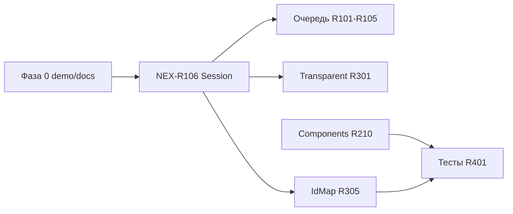

# Nextion — план рефакторинга

Живой backlog для поэтапного улучшения библиотеки `lib/Nextion`.
Отмечайте выполненное: `[x]`, в работе: `[~]`, отменено: `[-]`.

**Как идти:** с **глубины кода** (`core/` → `comp/` → `app/`) — см. «Bottom-up порядок».  
**Сейчас в приоритете:** Фаза 0 (демо/API) → **NEX-R106** (Session/UART) → очередь → Components → Transparent.

**Backlog:** [REFACTORING_REWORKED.md](REFACTORING_REWORKED.md) (активный scope) · [smartApp/IdMap.md](smartApp/IdMap.md) · [TRANSPARENT_PROTOCOL.md](TRANSPARENT_PROTOCOL.md) · **Отложено:** [REFACTORING_DEFERRED.md](REFACTORING_DEFERRED.md) · **Точка входа:** [README.md](README.md).

---

## Карта фаз

| Фаза | Фокус | Ключевые ID |
|------|--------|-------------|
| **0** | Quick wins, демо, docs | NEX-R0a…R0e |
| **1** | Session / UART (критично) | **NEX-R106** |
| **2** | Очередь, timeout, UART policy | NEX-R101…R105 |
| **3** | Components / attr API | NEX-R210…R217 |
| **4** | Application architecture | split `IAppUI` ✓, R204 ✓ |
| **5** | Transparent / raw, IdMap | [R301…R302](TRANSPARENT_PROTOCOL.md), [R303…R305 / R011](smartApp/IdMap.md) |
| **6** | Тесты, примеры, infra | NEX-R401…R405, R011, R012 |
| **—** | Закрытые quick wins (история) | NEX-R001…R010, R403 |

---

## Bottom-up порядок (ядро → приложение)

| Слой | Модули | Пункты backlog |
|------|--------|----------------|
| **0. Типы и протокол** | `nexTypes.hpp`, `nexProtocol.hpp` | NEX-R002 ✓ |
| **1. Session / Gateway** | `nexSession.*`, `nexGateway.*` | **NEX-R106**, [R104](REFACTORING_REWORKED.md), R105 |
| **2. Commands / Messages** | `nexCommands.*`, `nexMessages.hpp` | R403 ✓ |
| **3. Ошибки** | `app/nexErrors.hpp` | R008, [R103](REFACTORING_REWORKED.md) ✓ |
| **4. SysVar helpers** | `nexSysVars.*` | R009 ✓, R216 ✓ |
| **5. Components** | `nexComponents.hpp`, `nexExComponents.hpp`, `nexCompImpl.*` | R210…R217 |
| **6. Application / SmartApp** | `nexApplication.*`, `nexAppUI.*`, `nexSmartApp.*`, facades, `nexMsgBox.*` | R101, R201, R204 ✓, IAppUI split ✓ |
| **7. IdMap** | `smartApp/nexIdMap.*` | [R303…R305, R011](smartApp/IdMap.md) |
| **8. Examples / tests** | `examples/`, host tests | R011, R401, example4/5 |

**Следующие шаги:** NEX-R106 ✓, NEX-R101 ✓ → R210…

---

## Сводка по модулям (актуально)

| Модуль | Файлы | Состояние |
|--------|-------|-----------|
| **Application** | `app/nexApplication.*`, `nexApplicationAddons.cpp` | UART-цикл; `enqueue`/`update`/`dispatchResponse`; `_lastError*` |
| **SmartApp / IdMap** | `smartApp/nexSmartApp.*`, `smartApp/nexIdMap.*` | Discover + Flash; `applyFromTable`; не transport layer |
| **Ошибки** | `app/nexErrors.hpp`, `app/nexErrorFormat.cpp` | `makeAppError`, `formatStatusMessage`, `printStatusError`; recovery inline в `nexApplication.cpp` |
| **Session** | `core/nexSession.*` | `Transaction::Kind`, `awaiting_status` wire-mask; `_active` убран ✓ |
| **Gateway** | `core/nexGateway.*` | RX/TX framer; `isTxIdle` |
| **Commands** | `core/nexCommands.*` | NIS-слой; `NEX_DBG_TRACE_TX` |
| **Components** | `nexComponents.hpp` + **`nexExComponents.hpp`** | База в `nexCompImpl.hpp`; Ex: Audio, FileStream, MediaComponent, DataFile, DataRecord, FileBrowser… |
| **Facades** | `nexApplicationFacades.*` | ep/fs/audio/sleep/touch; **`_*_t` — заглушки** (NEX-R301) |
| **Examples** | `example1…5` | example4 — стенд Session/ошибок; example5 — все листья `nexComponents` (24 виджета) |

**Include:** `nex.hpp` → только `nexComponents.hpp`. ExComponents: `#include "comp/nexExComponents.hpp"` отдельно.

---

## Модель ошибок (`app/nexErrors.hpp`)

| Роль | Что это | В коде |
|------|---------|--------|
| **Транспорт** | ByteStream → Gateway → Session | `AppErrorReporter::Stream/Gateway/Session` |
| **Панель** | NIS-ответы | `msg::Status`; `Application::dispatchError` → `onError` |
| **Домен** | Page/Component registry | `AppErrorReporter::Register` + `MISC::RegStatus` |
| **Процедура** | IdMap Discover | `SmartApp`; маршрут `Route::kCompIdMapPoll*` (0xFE/0xFE) |

**IdMap Discover — не transport layer.** Таймаут на 0xFE/0xFE не дублирует `SessionTimeout` в UI (NEX-R007 ✓). `pollFail` → `onCompIdMapComplete(false)`.

### Матрица путей (фактический код)

| Источник сбоя | Reporter | Subject |
|---------------|----------|---------|
| `tryEnqueue` false (не QueueFull) | Session | `Transaction` route |
| `tryEnqueue` false (QueueFull) | Session | spin в `enqueue()` → timeout → `QueueFull` |
| `Session::begin` push fail | Session `PushFailed` | serialize fail → **pop head** (битая команда, retry бессмысленен) |
| `Session::transmit` fail | Session `TransmitFailed` | active tx |
| `pollTimeout` | Session `ResponseTimedOut` | active tx |
| RX / Gateway | Gateway / Stream | `(0,0)` или active tx |
| `dispatchResponse` NIS Status | Panel | route транзакции |
| `dispatchEvent` Status | Panel | **status вне активной транзакции `(0,0)`** |
| `registerPage` / `registerComponent` | Register | Page / Component |

---

## Аудит 2026-06 — известные проблемы

| Severity | ID | Суть |
|----------|-----|------|
| **Critical** | R106 | Wire-маска `awaiting_status` + correlate ✓ |
| **High** | R106d | `sessionWaitMask` vs `statusCorrelateMask` ✓ |
| **High** | R301 | `AwaitingTransparentTx` / `AwaitingRawDataRx` без timeout и `dispatchResponse` → **зависание очереди** |
| **Medium** | R305 | `idmap::Table::upsert` принимает `panel_id=0xFF` | → [smartApp/IdMap.md](smartApp/IdMap.md) |
| **Low** | R0b | `kAttrId{"id"}` в `smartApp/nexSmartApp.cpp` дублирует `nexAttrLexemes.hpp` |

---

## Фаза 0 — Quick wins (демо, docs, мелочи)

- [x] **NEX-R0a** — `demoSlidingText` без `setVAlign` / `ycen`
  - **Файлы:** `examples/example5/demo_controls.hpp`, `SlidingText::setVAlign = delete`
  - **Сложность:** S

- [x] **NEX-R0b** — Discover: `kAttrId` → `attr::literal(attr::Id::Id)`
  - **Файлы:** `smartApp/nexSmartApp.cpp`, include `nexAttrLexemes.hpp`
  - **Сложность:** S

- [-] **NEX-R0c** — `dispatchError`: не вызывать `onError` для `Success` — **отменено** (`bkcmd=Always` только для отладки, шум OK)

- [x] **NEX-R0d** — Синхронизация этого файла с реальной структурой кода
  - **Сложность:** S

- [x] **NEX-R0e** — README example5: SlidingText (`txt`/`val_y`, не `path`); bkcmd static vs live
  - **Файлы:** `examples/example5/README.md`
  - **Сложность:** S

---

## Фаза 1 — Session / UART (критично, NEX-R106)

**Зависимости:** корректная семантика `bkcmd`, маршрутизация panel-status, fire-and-forget vs `Always`.

- [-] **NEX-R106a** — Порядок в `update()`: `receive()` **до** `pollTimeout` — **отменено**
  - Ответ на команду **не приходит в том же тике**, что завершение TX; перестановка не меняет поведение
  - **Файлы:** `app/nexApplication.cpp`

- [-] **NEX-R106b** — Ослабить gate `txIdle` в `dispatchResponse` — **отменено**
  - Панель не шлёт status по текущей serial-команде, пока кадр не принят целиком; gate корректен
  - Фоновые кадры — через `dispatchEvent`, не active session

- [-] **NEX-R106c** — `PushFailed`: не `pop()` head — **отменено**
  - `PushFailed` ≈ `SerializeFailed` / битая команда; повтор бессмысленен, pop head — правильно

- [x] **NEX-R106** — Wire-маска `Transaction::awaiting_status` (`AwaitingStatus`, bit = wire 0x00…0x24)
  - **PR-1 ✓**, **PR-1b ✓**, **PR-2 ✓**, **R106d ✓**, **R106e ✓**
  - **Отложено:** [R106f](REFACTORING_DEFERRED.md) (`lastTx` / LastCompleted)
  - **Файлы:** `core/nexStatusMask.hpp`, `nexSession.*`, `nexApplication.cpp`, `nexCommands.*`
  - **Сложность:** M

- [x] **NEX-R106d** — `bkcmdAllowedStatus` (NIS §6.13): `sessionWaitMask` vs `statusCorrelateMask`; `0x24` bkcmd-independent → status вне активной транзакции
  - **Файлы:** `core/nexSession.hpp`, `core/nexSession.cpp`, `core/nexStatusMask.hpp`
  - **Сложность:** S

- [x] **NEX-R106e** — NoAwaiting через `awaiting_status = kAwaitingNone` (не отдельный `State`)
  - bulk assign / waveform `add` → `kAwaitingNone` явно в точках enqueue; `bkcmd` Off/OnFailure обнуляет wait-mask в session
  - **Файлы:** `comp/nexAttributes.hpp`, `comp/resources/waveform.hpp`, `app/nexApplicationAddons.cpp`
  - **Сложность:** S

- [-] **NEX-R106f** — last-tx / fail-route status вне активной транзакции → `(page, comp)` — **отложено**, см. [REFACTORING_DEFERRED.md](REFACTORING_DEFERRED.md)

---

## Фаза 2 — Надёжность очереди и UART

- [x] **NEX-R101** — `tryEnqueue(Transaction) -> bool` — `Session::tryEnqueue` + `Application::tryEnqueue`; blocking `enqueue` без изменений
  - **Файлы:** `app/nexApplication.hpp/cpp`, `core/nexSession.hpp/cpp`
  - **Сложность:** S

- [x] **NEX-R102** — Лимит повторов на голову очереди (исторический пункт; логика в `enqueue` spin)
  - **Файлы:** `app/nexApplication.cpp`
  - **Сложность:** M

- [x] **NEX-R102b** — `pumpUntilIdle()` → `bool` (`true` = idle, `false` = stall-timeout)
  - **Файлы:** `app/nexApplication.hpp/cpp`, `examples/example5/demo_controls.hpp`, `examples/example6/app.hpp`
  - **Сложность:** S

- [x] **NEX-R103** — UART stream status + RX retry (`processTransportFault`, `retryActive`) — [REFACTORING_REWORKED.md](REFACTORING_REWORKED.md)

- [x] **NEX-R104** — Настраиваемый размер очереди Session (`NEX_SESSION_QUEUE_CAPACITY` в `nexConfig.hpp`)
  - `TransactionQueue::kCapacity` берётся из глобального compile-time config; `kMaxObjectSize = 128` оставлен internal до отдельной проработки упаковки очереди
  - **Файлы:** `nexConfig.hpp`, `core/nexSession.hpp`, docs
  - **Сложность:** S

- [x] **NEX-R105** — Настраиваемый `kDefaultGetResponseTimeoutMs`
  - ctor-параметр + `setGetResponseTimeoutMs()` / `getResponseTimeoutMs()`
  - **Файлы:** `app/nexApplication.hpp`, `nexApplication.cpp`
  - **Сложность:** S

---

## Фаза 3 — Components / attr API

См. также `comp/ATTRIBUTE_REFACTORING.md`.

### ExComponents (структура)

- [x] **NEX-R209a** — Перенос `DataFile`, `DataRecord`, `MediaComponent` в `nexExComponents.hpp`
- [x] **NEX-R209b** — example5: только `nexComponents` (24 виджета); DataRecord убран из demo

### API и NIS

- [x] **NEX-R210** — `setVAlign` только у типов с NIS `ycen` (не на `Multiline` базе)
  - **Файлы:** `comp/nexCompImpl.hpp`, `nexComponents.hpp`, `examples/example5/demo_controls.hpp`
  - **Сложность:** M

- [-] **NEX-R211** — `SlidingText`: `ch`, `maxval_y` — **отменено** (в MCU API намеренно не экспортируем; достаточно `txt`, `val_y`, `left`)

- [-] **NEX-R212** — `TextSelect`: без зеркала `txt`, достаточно `val` — **отложено** ([DEFERRED](REFACTORING_DEFERRED.md); список из `path`, выбор по `val`)

- [-] **NEX-R213** — `onResponse` chain через `Printable` — **отменено** (`Printable`/`Multiline`/`Textual` без txt-зеркал; листья → `TouchArea` для геометрии — текущий паттерн)

- [x] **NEX-R214** — Waveform `add`: `kAwaitingNone` + документ `bkcmd=OnFailure`; example5 live probe (0x12)
  - **Файлы:** `comp/resources/waveform.hpp`, `examples/example5/`
  - **Сложность:** S

- [ ] **NEX-R215** — Waveform `addt`: буфер TX + R301 — [REWORKED](REFACTORING_REWORKED.md)
  - **Зависит от:** NEX-R301
  - **Сложность:** M / XL

- [x] **NEX-R216** — Wire↔MCU: `nex::wire` в `nexTypes.hpp` (`toWire`/`fromWire`, traits); attr + SysVar
  - **Файлы:** `core/nexTypes.hpp`, `comp/nexAttributes.hpp`, `app/nexSysVars.hpp`
  - **Сложность:** M

- [ ] **NEX-R217** — Mirror attr/SysVar после успешного enqueue — [REWORKED](REFACTORING_REWORKED.md)
  - **Зависит от:** NEX-R101
  - **Сложность:** M

- [x] **NEX-R218** — ExComponents: полный рефакторинг `DataFile`/`DataRecord`/`FileBrowser` — [REWORKED](REFACTORING_REWORKED.md)
  - **Сложность:** M / L

---

## Фаза 4 — Application architecture

- [-] **NEX-R201** — SmartApp: dev-only Discover, не в release — **отложено** ([DEFERRED](REFACTORING_DEFERRED.md); возможно пересмотреть форму взаимодействия, не `ISmartAppHost`)

- [x] **NEX-R204** — `friend class` сведён к минимуму: `detail::register*` вместо `friend Page`; `AppCanvas`/`AppTouch`/`AppSleep` — private ctor + `friend Application`; исключения — `SmartApp`, `ObjRegistry`

- [x] **NEX-R205** — `dispatchResponse`: Status до `switch`, payload по Kind, stubs `TransparentTx`/`RawDataRx` (без `nexDispatch.hpp`)
  - **Файлы:** `app/nexApplication.cpp`
  - **Сложность:** M (минимальный scope)

- [-] **NEX-R206** — MsgBox вне `Application` — **отменено**: `evMsgBox` в `Message`, генератор — `Application::msgBox`

- [x] **Application / `IAppUI` / `AppUI<N>`** — registry и routing вынесены; pump + shell в `Application`

- [x] **NEX-R008** — `formatStatusMessage` / `printStatusError` → `app/nexErrorFormat.cpp`
  - **Файлы:** `app/nexErrorFormat.cpp`, `app/nexErrors.hpp` (`app/*.cpp` уже в srcFilter)
  - **Сложность:** M

### Исторические (логика слита в Application + nexErrors)

- [x] **NEX-R202** — ~~AppErrorHandler~~ → inline в `nexApplication.cpp` + `nexErrors.hpp`
- [x] **NEX-R203** — ~~AppFailure struct~~ → `makeAppError` + `onStatus`
- [x] **NEX-R203b** — Session `begin`/`transmit`/`end` в `nexSession.*` ✓

---

## Фаза 5 — Transparent / raw и IdMap

### Transparent (критично при использовании `_t` API)

- [ ] **NEX-R301** — `AwaitingTransparentTx` / `AwaitingRawDataRx` в `dispatchResponse` + timeout
  - **Файлы:** `app/nexApplication.cpp`, `core/nexGateway.*`, `nexApplicationFacades.*`
  - **Сложность:** XL
  - **Блокирует:** `ep.write_t`, `fs.file_*_t`, `waveform.addt`

- [ ] **NEX-R302** — Использовать `buffer` в `write_t` / `read_t`
  - **Сложность:** XL (вместе с R301)

**До R301:** не вызывать `*_t` / `addt` из prod; в заголовках — `@experimental`.

### IdMap / SmartApp

**Открытый backlog:** [smartApp/IdMap.md](smartApp/IdMap.md) — R303…R305c, R011.

---

## Фаза 6 — Тесты и инфраструктура

- [-] **NEX-R401** — Host unit-тесты — [DEFERRED](REFACTORING_DEFERRED.md) (регрессия example4/6 на панели)
  - **Сложность:** L

- [-] **NEX-R402** — Mock `IByteStream` — [DEFERRED](REFACTORING_DEFERRED.md) (регрессия на железе)
  - **Сложность:** M

- [x] **NEX-R403** — `NEX_DEBUG`, `NEX_IDMAP_DEBUG`, `NEX_TRACE_TX` в `nexDebug.hpp` ✓

- [x] **NEX-R404** — `library.json` srcFilter — checklist в [README.md](README.md#сборка-библиотеки-libraryjson)
  - **Сложность:** S

- [x] **NEX-R405** — Стиль комментариев RU/EN — [README.md](README.md#комментарии-в-коде-nex-r405)
  - **Сложность:** S (косметика)

- [x] **NEX-R012** — README библиотеки (`lib/Nextion/README.md`)
  - **Сложность:** S

---

## Закрытые пункты (история, Фаза «legacy quick wins»)

- [x] **NEX-R001** — IdMap: `SmartApp` + `idmap::Table` (`loadFromBuffer`, `applyFromTable`)
- [ ] **NEX-R001b** — Пример Flash (→ NEX-R011)
- [x] **NEX-R002** — `namespace Route` в `nexTypes.hpp`
- [x] **NEX-R003** — IdMap debug только при `NEX_IDMAP_DEBUG`
- [x] **NEX-R004** — Убрать static из poll state (→ поля в SmartApp)
- [x] **NEX-R005** / **NEX-R306** — удалён `showErrorBox`
- [x] **NEX-R006** — `clearErrors()` сбрасывает `_lastError*`
- [x] **NEX-R007** — Нет двойного `onError` на Discover timeout 0xFE
- [x] **NEX-R009** — `enqueueSysVarNumericAssign` в `nexSysVars.cpp`
- [x] **NEX-R010** — Debug IdMap убран из `nexApplication.cpp`

---

## Известные архитектурные решения (не трогать без причины)

| Решение | Почему оставить |
|---------|-----------------|
| Не вызывать `setId()` в `onPollResponse` | swap в `_registry` ломает tag=slot |
| Страницы `0..N-1` подряд для Discover | упрощает машину опроса |
| `msg::Status` + `AppError` в одном `onError` | единая точка UI |
| `friend` для регистрации Page/Component | ctor регистрирует до return |
| example5 static demo: `bkcmd=Always`; live: `bkcmd=OnFailure` | attr-ошибки vs streaming `add` |
| `nexComponents` vs `nexExComponents` | example5 покрывает только базовые листья |

---

## Рекомендуемый порядок PR

1. **PR-1 (Фаза 0):** NEX-R0a + R0b + R0c + R0e  
2. **PR-2 (Фаза 1):** NEX-R106 (masks) + R106d + R106e ~~(+ R106f)~~ отложено  
3. **PR-3 (Фаза 3):** NEX-R210 (Multiline / VAlign)  
4. **PR-4 (Фаза 2):** NEX-R105  
5. **PR-5 (IdMap):** [NEX-R305 + NEX-R011](smartApp/IdMap.md) (Flash example)  
6. **PR-6 (отдельная ветка):** NEX-R301 Transparent (XL)

---

## Журнал изменений

| Дата | ID | Статус | Комментарий |
|------|-----|--------|-------------|
| 2026-06-01 | R0d, R209 | done | Аудит кода; REFACTORING sync; ExComponents move; example5 без DataRecord |
| 2026-06-01 | R106a–c | cancelled | RX order / txIdle / PushFailed pop — не баги после разбора протокола |
| 2026-06-18 | R106d, R105 | done | маски задокументированы; timeout настраиваемый |
| 2026-06-01 | R106 PR-1 | in progress | Kind, wire mask, bkcmd split, EmptyCommand, handoff doc |
| 2026-06-18 | R102b | done | `pumpUntilIdle()` → `bool`; ex5/ex6 log on timeout |
| 2026-06-18 | R101 | scope | side-buffer снят → `tryEnqueue(bool)` + документ контракта `enqueue` |
| 2026-06-18 | R106f | deferred | lastTx / LastCompleted — [REFACTORING_DEFERRED.md](REFACTORING_DEFERRED.md) |
| 2026-05-27 | NEX-R403 | done | nexDebug.hpp, NEX_DBG / NEX_IDMAP_DEBUG / NEX_TRACE_TX |
| 2026-05-27 | NEX-R003…R010, R102 | done | clearErrors, retry, IdMap poll fixes |
| 2026-05-27 | rename | done | IdMap → `smartApp/nexIdMap.*`, Discover → `SmartApp` |
| 2026-05-27 | — | создан | Первичный аудит `lib/Nextion` |
