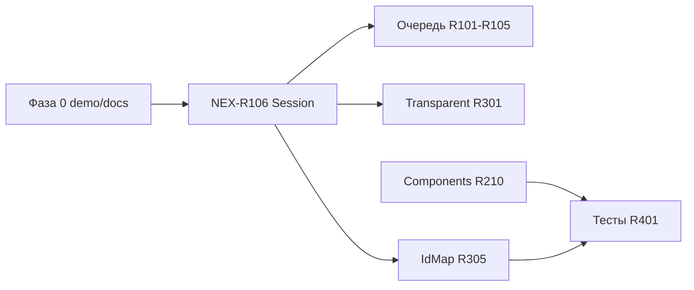

# Nextion — план рефакторинга

Живой backlog для поэтапного улучшения библиотеки `lib/Nextion`.
Отмечайте выполненное: `[x]`, в работе: `[~]`, отменено: `[-]`.

**Как идти:** с **глубины кода** (`core/` → `comp/` → `app/`) — см. «Bottom-up порядок».  
**Сейчас в приоритете:** Фаза 0 (демо/API) → **NEX-R106** (Session/UART) → очередь → Components → Transparent.

---

## Карта фаз

| Фаза | Фокус | Ключевые ID |
|------|--------|-------------|
| **0** | Quick wins, демо, docs | NEX-R0a…R0e |
| **1** | Session / UART (критично) | **NEX-R106** |
| **2** | Очередь, timeout, UART policy | NEX-R101…R105, R102b |
| **3** | Components / attr API | NEX-R210…R217 |
| **4** | Application architecture | NEX-R201…R206 |
| **5** | Transparent / raw, IdMap | NEX-R301…R302, R303…R305 |
| **6** | Тесты, примеры, infra | NEX-R401…R405, R011, R012 |
| **—** | Закрытые quick wins (история) | NEX-R001…R010, R403 |

---

## Bottom-up порядок (ядро → приложение)

| Слой | Модули | Пункты backlog |
|------|--------|----------------|
| **0. Типы и протокол** | `nexTypes.hpp`, `nexProtocol.hpp` | NEX-R002 ✓ |
| **1. Session / Gateway** | `nexSession.*`, `nexGateway.*` | **NEX-R106**, R104, R105 |
| **2. Commands / Messages** | `nexCommands.*`, `nexMessages.hpp` | R403 ✓ |
| **3. Ошибки** | `app/nexErrors.hpp` | R008, R103 ~ |
| **4. SysVar helpers** | `nexSysVars.*` | R009 ✓, R216 |
| **5. Components** | `nexComponents.hpp`, `nexExComponents.hpp`, `nexCompImpl.*` | R210…R217 |
| **6. Application / SmartApp** | `nexApplication.*`, `nexSmartApp.*`, facades | R101, R201…R206 |
| **7. IdMap** | `idmap/nexIdMap.*` | R303…R305 |
| **8. Examples / tests** | `examples/`, host tests | R011, R401, example4/5 |

**Следующие шаги:** NEX-R0a (SlidingText demo) → **NEX-R106** → NEX-R105 + NEX-R101.

---

## Сводка по модулям (актуально)

| Модуль | Файлы | Состояние |
|--------|-------|-----------|
| **Application** | `app/nexApplication.*`, `nexApplicationAddons.cpp` | UART-цикл; `enqueue`/`update`/`dispatchResponse`; `_lastError*` |
| **SmartApp / IdMap** | `app/nexSmartApp.*`, `idmap/nexIdMap.*` | Discover + Flash; `applyFromTable`; не transport layer |
| **Ошибки** | `app/nexErrors.hpp` | `makeAppError`, `formatStatusMessage`, `printStatusError`; recovery inline в `nexApplication.cpp` |
| **Session** | `core/nexSession.*` | Очередь 64×128 B; `begin`/`transmit`/`pollTimeout`/`end` |
| **Gateway** | `core/nexGateway.*` | RX/TX framer; `isTxIdle` |
| **Commands** | `core/nexCommands.*` | NIS-слой; `NEX_DBG_TRACE_TX` |
| **Components** | `nexComponents.hpp` + **`nexExComponents.hpp`** | База в `nexCompImpl.hpp`; Ex: Audio, FileStream, MediaComponent, DataFile, DataRecord, FileBrowser… |
| **Facades** | `nexApplicationFacades.*` | ep/fs/audio/sleep/touch; **`_*_t` — заглушки** (NEX-R301) |
| **Examples** | `example1…5` | example4 — стенд Session/ошибок; example5 — все листья `nexComponents` (24 виджета) |

**Include:** `nex.hpp` → только `nexComponents.hpp`. ExComponents: `#include "comp/nexExComponents.hpp"` отдельно.

---

## Модель ошибок (`app/nexErrors.hpp`)

| Роль | Что это | В коде |
|------|---------|--------|
| **Транспорт** | ByteStream → Gateway → Session | `AppErrorReporter::Stream/Gateway/Session` |
| **Панель** | NIS-ответы | `msg::Status`; `Application::dispatchError` → `onError` |
| **Домен** | Page/Component registry | `AppErrorReporter::Register` + `MISC::RegStatus` |
| **Процедура** | IdMap Discover | `SmartApp`; маршрут `Route::kCompIdMapPoll*` (0xFE/0xFE) |

**IdMap Discover — не transport layer.** Таймаут на 0xFE/0xFE не дублирует `SessionTimeout` в UI (NEX-R007 ✓). `pollFail` → `onCompIdMapComplete(false)`.

### Матрица путей (фактический код)

| Источник сбоя | Reporter | Subject |
|---------------|----------|---------|
| `tryEnqueue` false (не QueueFull) | Session | `Transaction` route |
| `tryEnqueue` false (QueueFull) | Session | spin в `enqueue()` → timeout → `QueueFull` |
| `Session::begin` push fail | Session `PushFailed` | serialize fail → **pop head** (битая команда, retry бессмысленен) |
| `Session::transmit` fail | Session `TransmitFailed` | active tx |
| `pollTimeout` | Session `ResponseTimedOut` | active tx |
| RX / Gateway | Gateway / Stream | `(0,0)` или active tx |
| `dispatchResponse` NIS Status | Panel | route транзакции |
| `dispatchEvent` Status | Panel | **orphan `(0,0)`** |
| `registerPage` / `registerComponent` | Register | Page / Component |

---

## Аудит 2026-06 — известные проблемы

| Severity | ID | Суть |
|----------|-----|------|
| **Critical** | R106 | Status routing: byte без pid/cid на проводе; **маски групп cmd/attr** + plausibility; orphan → `(0,0)` |
| **High** | R106d | `pollTimeout`: только `Always` vs «всё остальное»; нужны 4 режима `BkCmd` |
| **High** | R301 | `AwaitingTransparentTx` / `AwaitingRawDataRx` без timeout и `dispatchResponse` → **зависание очереди** |
| **High** | R210 | `Multiline::setVAlign` → `ycen` на SlidingText (type 62) → **0x1A** в example5 |
| **Medium** | R305 | `idmap::Table::upsert` принимает `panel_id=0xFF`, `applyFromTable` пропускает |
| **Medium** | R102b | `pumpUntilIdle()` выходит по stall-timeout, очередь может быть не пуста |
| **Medium** | R217 | `attr::Num` / `SysVar`: mirror до успешного enqueue |
| **Low** | R0b | `kAttrId{"id"}` в `nexSmartApp.cpp` дублирует `nexAttrLexemes.hpp` |

---

## Фаза 0 — Quick wins (демо, docs, мелочи)

- [x] **NEX-R0a** — `demoSlidingText` без `setVAlign` / `ycen`
  - **Файлы:** `examples/example5/demo_controls.hpp`, `SlidingText::setVAlign = delete`
  - **Сложность:** S

- [x] **NEX-R0b** — Discover: `kAttrId` → `attr::literal(attr::Id::Id)`
  - **Файлы:** `app/nexSmartApp.cpp`, include `nexAttrLexemes.hpp`
  - **Сложность:** S

- [-] **NEX-R0c** — `dispatchError`: не вызывать `onError` для `Success` — **отменено** (`bkcmd=Always` только для отладки, шум OK)

- [x] **NEX-R0d** — Синхронизация этого файла с реальной структурой кода
  - **Сложность:** S

- [x] **NEX-R0e** — README example5: SlidingText (`txt`/`val_y`, не `path`); bkcmd static vs live
  - **Файлы:** `examples/example5/README.md`
  - **Сложность:** S

---

## Фаза 1 — Session / UART (критично, NEX-R106)

**Зависимости:** корректная семантика `bkcmd`, маршрутизация panel-status, fire-and-forget vs `Always`.

- [-] **NEX-R106a** — Порядок в `update()`: `receive()` **до** `pollTimeout` — **отменено**
  - Ответ на команду **не приходит в том же тике**, что завершение TX; перестановка не меняет поведение
  - **Файлы:** `app/nexApplication.cpp`

- [-] **NEX-R106b** — Ослабить gate `txIdle` в `dispatchResponse` — **отменено**
  - Панель не шлёт status по текущей serial-команде, пока кадр не принят целиком; gate корректен
  - Фоновые кадры — через `dispatchEvent`, не active session

- [-] **NEX-R106c** — `PushFailed`: не `pop()` head — **отменено**
  - `PushFailed` ≈ `SerializeFailed` / битая команда; повтор бессмысленен, pop head — правильно

- [ ] **NEX-R106** — Wire-маска `Transaction::awaiting_status` (`AwaitingStatus`, bit = wire code 0x00…0x24)
  - PR-1 ✓ skeleton: `SendCommand`, `nexStatusMask.hpp`, `statusCorrelatesWithTransaction`, `sessionWaitMask` / `statusCorrelateMask`
  - PR-2: `Command::defaultAwaitingStatus()`, пресеты, example6 без `isDataRecordFileNoise`
  - correlated → route tx; иначе → `(0,0)`; не завершать session чужим кодом
  - **Файлы:** `core/nexStatusMask.hpp`, `app/nexApplication.cpp`, `core/nexSession.hpp`
  - **Сложность:** M

- [ ] **NEX-R106d** — `bkcmdAllowedStatus` (NIS §6.13): `sessionWaitMask` vs `statusCorrelateMask`; `0x24` bkcmd-independent → orphan
  - **Файлы:** `core/nexSession.hpp`, `core/nexSession.cpp`
  - **Сложность:** S (частично в PR-1)

- [ ] **NEX-R106e** — NoAwaiting через `awaiting_status = kAwaitingNone` (не отдельный `State`)
  - default bulk assign → `kAwaitingNone`; `bkcmd` Off/OnFailure обнуляет маску в session
  - **Файлы:** `comp/nexAttributes.hpp`, attr enqueue defaults
  - **Сложность:** S

- [ ] **NEX-R106f** — Регрессия example4: OnFailure + invalid attr → `(page, comp)` через last-tx + маска, не orphan `(0,0)`
  - **Файлы:** `examples/example4/app.hpp`
  - **Сложность:** S
  - **Зависит от:** NEX-R106

---

## Фаза 2 — Надёжность очереди и UART

- [ ] **NEX-R101** — Буфер отложенных транзакций при `QueueFull`
  - **Что:** не терять `Transaction`; повтор после освобождения слота
  - **Файлы:** `app/nexApplication.cpp`, возможно `Session`
  - **Сложность:** L
  - **Зависит от:** NEX-R106

- [x] **NEX-R102** — Лимит повторов на голову очереди (исторический пункт; логика в `enqueue` spin)
  - **Файлы:** `app/nexApplication.cpp`
  - **Сложность:** M

- [ ] **NEX-R102b** — `pumpUntilIdle()` → `bool` «реально idle» или явный timeout-результат
  - **Файлы:** `app/nexApplication.hpp`, `nexApplication.cpp`
  - **Сложность:** S

- [~] **NEX-R103** — Политики UART (`ByteStreamPolicy`)
  - **Что:** `Disconnected` → link-down; `BitError`/`FrameError` → flush RX, retry с лимитом
  - **Файлы:** `app/nexErrors.hpp`, `app/nexApplication.cpp`
  - **Сложность:** L

- [ ] **NEX-R104** — Настраиваемый размер очереди Session (`kCapacity`, `kMaxObjectSize`)
  - **Файлы:** `core/nexSession.hpp`
  - **Сложность:** M

- [ ] **NEX-R105** — Настраиваемый `kDefaultGetResponseTimeoutMs`
  - **Файлы:** `app/nexApplication.hpp`, `nexApplication.cpp`
  - **Сложность:** S

---

## Фаза 3 — Components / attr API

См. также `comp/ATTRIBUTE_REFACTORING.md`.

### ExComponents (структура)

- [x] **NEX-R209a** — Перенос `DataFile`, `DataRecord`, `MediaComponent` в `nexExComponents.hpp`
- [x] **NEX-R209b** — example5: только `nexComponents` (24 виджета); DataRecord убран из demo

### API и NIS

- [ ] **NEX-R210** — `setVAlign` только у типов с NIS `ycen` (не на `Multiline` базе)
  - **Файлы:** `comp/nexCompImpl.hpp`, `nexComponents.hpp`
  - **Сложность:** M

- [ ] **NEX-R211** — `SlidingText`: опционально `ch`, `maxval_y` по NIS type 62
  - **Сложность:** S

- [ ] **NEX-R212** — `TextSelect::onResponse(Txt)` — восстановить или удалить мёртвый код
  - **Файлы:** `comp/nexComponents.hpp`
  - **Сложность:** S

- [ ] **NEX-R213** — `onResponse` chain: Text/SlidingText/ScrollText → `Printable`, не `TouchArea`
  - **Сложность:** S

- [ ] **NEX-R214** — Waveform `add`: политика Idle vs `bkcmd=OnFailure` (документ + example5 live)
  - **Файлы:** `comp/resources/waveform.hpp`, example5
  - **Сложность:** S

- [ ] **NEX-R215** — Waveform `addt`: буфер TX + NEX-R301, иначе пометить experimental / delete
  - **Файлы:** `comp/resources/waveform.hpp`
  - **Сложность:** M / XL

- [ ] **NEX-R216** — Общий `nexWireTypes.hpp` для `nexSysVars` + `nexAttributes`
  - **Сложность:** M

- [ ] **NEX-R217** — Mirror attr/SysVar после успешного enqueue (или rollback)
  - **Файлы:** `comp/nexAttributes.hpp`, `app/nexSysVars.hpp`
  - **Сложность:** M

- [ ] **NEX-R218** — ExComponents: проверить NIS `dis`/`bco2`/`pco2` на `DataFile` (TODO в коде)
  - **Файлы:** `comp/nexExComponents.hpp`
  - **Сложность:** S

---

## Фаза 4 — Application architecture

- [ ] **NEX-R201** — `SmartAppHost` / narrow API вместо `friend` + `_session`
  - **Файлы:** `app/nexSmartApp.*`, `app/nexApplication.hpp`
  - **Сложность:** M

- [ ] **NEX-R204** — Свести `friend class` к минимуму
  - **Аудит:** `Application` ↔ `SmartApp`, `Page`, `MsgBox`
  - **Сложность:** L

- [ ] **NEX-R205** — Таблица маршрутов в `dispatchResponse`
  - **Файлы:** `app/nexApplication.cpp`
  - **Сложность:** M

- [ ] **NEX-R206** — Документировать `lastError()` vs NIS Status vs AppError
  - **Сложность:** S

- [ ] **NEX-R008** — `formatStatusMessage` / `printStatusError` → `.cpp`
  - **Файлы:** новый `app/nexErrorFormat.cpp`, `library.json`
  - **Сложность:** M

- [ ] **NEX-R307** — Optional: split `NexRuntime` / `NexApp`
  - **Сложность:** XL

### Исторические (логика слита в Application + nexErrors)

- [x] **NEX-R202** — ~~AppErrorHandler~~ → inline в `nexApplication.cpp` + `nexErrors.hpp`
- [x] **NEX-R203** — ~~AppFailure struct~~ → `makeAppError` + `dispatchError`
- [x] **NEX-R203b** — Session `begin`/`transmit`/`end` в `nexSession.*` ✓

---

## Фаза 5 — Transparent / raw и IdMap

### Transparent (критично при использовании `_t` API)

- [ ] **NEX-R301** — `AwaitingTransparentTx` / `AwaitingRawDataRx` в `dispatchResponse` + timeout
  - **Файлы:** `app/nexApplication.cpp`, `core/nexGateway.*`, `nexApplicationFacades.*`
  - **Сложность:** XL
  - **Блокирует:** `ep.write_t`, `fs.file_*_t`, `waveform.addt`

- [ ] **NEX-R302** — Использовать `buffer` в `write_t` / `read_t`
  - **Сложность:** XL (вместе с R301)

**До R301:** не вызывать `*_t` / `addt` из prod; в заголовках — `@experimental`.

### IdMap / SmartApp

- [ ] **NEX-R303** — Индекс `(page_id, compiled_id)` в `idmap::Table::find`
  - **Сложность:** M

- [ ] **NEX-R304** — Прогресс Discover `(done, total)` для UI boot
  - **Файлы:** `app/nexSmartApp.*`
  - **Сложность:** M

- [ ] **NEX-R305** — Валидация `panel_id`: отклонять `0`, `0xFF`, `kPageCompId`, дубликаты на странице
  - **Файлы:** `idmap/nexIdMap.cpp`, `app/nexSmartApp.cpp`
  - **Сложность:** S

- [ ] **NEX-R305b** — `idMapLoadFromBuffer()`: сброс `_phase` Discover
  - **Сложность:** S

- [ ] **NEX-R305c** — Discover: обход `ObjRegistry::next()` вместо scan id `1…255`
  - **Сложность:** M

- [ ] **NEX-R011** — Пример Flash: Discover → encode → reboot → `idMapLoadFromBuffer`
  - **Файлы:** `examples/`, `platformio.ini`
  - **Сложность:** M

---

## Фаза 6 — Тесты и инфраструктура

- [ ] **NEX-R401** — Host unit-тесты (PlatformIO native)
  - **Кандидаты:** `idmap::Table` encode/decode, `RxFramer`, `TranslateMessage`, `Session` queue
  - **Сложность:** L

- [ ] **NEX-R402** — Mock `IByteStream`
  - **Зависит от:** R401
  - **Сложность:** M

- [x] **NEX-R403** — `NEX_DEBUG`, `NEX_IDMAP_DEBUG`, `NEX_TRACE_TX` в `nexDebug.hpp` ✓

- [ ] **NEX-R404** — Проверка `library.json` srcFilter после новых `.cpp`
  - **Сложность:** S

- [ ] **NEX-R405** — Стиль комментариев RU/EN в заголовках
  - **Сложность:** S (косметика)

- [ ] **NEX-R012** — README библиотеки (`lib/Nextion/README.md`)
  - **Сложность:** S

---

## Закрытые пункты (история, Фаза «legacy quick wins»)

- [x] **NEX-R001** — IdMap: `SmartApp` + `idmap::Table` (`loadFromBuffer`, `applyFromTable`)
- [ ] **NEX-R001b** — Пример Flash (→ NEX-R011)
- [x] **NEX-R002** — `namespace Route` в `nexTypes.hpp`
- [x] **NEX-R003** — IdMap debug только при `NEX_IDMAP_DEBUG`
- [x] **NEX-R004** — Убрать static из poll state (→ поля в SmartApp)
- [x] **NEX-R005** / **NEX-R306** — удалён `showErrorBox`
- [x] **NEX-R006** — `clearErrors()` сбрасывает `_lastError*`
- [x] **NEX-R007** — Нет двойного `onError` на Discover timeout 0xFE
- [x] **NEX-R009** — `enqueueSysVarNumericAssign` в `nexSysVars.cpp`
- [x] **NEX-R010** — Debug IdMap убран из `nexApplication.cpp`

---

## Известные архитектурные решения (не трогать без причины)

| Решение | Почему оставить |
|---------|-----------------|
| Не вызывать `setId()` в `onPollResponse` | swap в `_registry` ломает tag=slot |
| Страницы `0..N-1` подряд для Discover | упрощает машину опроса |
| `msg::Status` + `AppError` в одном `onError` | единая точка UI |
| `friend` для регистрации Page/Component | ctor регистрирует до return |
| example5 static demo: `bkcmd=Always`; live: `bkcmd=OnFailure` | attr-ошибки vs streaming `add` |
| `nexComponents` vs `nexExComponents` | example5 покрывает только базовые листья |

---

## Рекомендуемый порядок PR

1. **PR-1 (Фаза 0):** NEX-R0a + R0b + R0c + R0e  
2. **PR-2 (Фаза 1):** NEX-R106 (masks) + R106d + R106e (+ R106f в example4)  
3. **PR-3 (Фаза 3):** NEX-R210 (Multiline / VAlign)  
4. **PR-4 (Фаза 2):** NEX-R105 + R101 + R102b  
5. **PR-5 (Фаза 5):** NEX-R305 + NEX-R011 (Flash example)  
6. **PR-6 (отдельная ветка):** NEX-R301 Transparent (XL)

---

## Журнал изменений

| Дата | ID | Статус | Комментарий |
|------|-----|--------|-------------|
| 2026-06-01 | R0d, R209 | done | Аудит кода; REFACTORING sync; ExComponents move; example5 без DataRecord |
| 2026-06-01 | R106a–c | cancelled | RX order / txIdle / PushFailed pop — не баги после разбора протокола |
| 2026-06-01 | R106 | planned | Status masks + bkcmd modes + NoAwaiting — example6/example5 |
| 2026-05-27 | NEX-R403 | done | nexDebug.hpp, NEX_DBG / NEX_IDMAP_DEBUG / NEX_TRACE_TX |
| 2026-05-27 | NEX-R003…R010, R102 | done | clearErrors, retry, IdMap poll fixes |
| 2026-05-27 | rename | done | IdMap → `idmap/nexIdMap.*`, Discover → `SmartApp` |
| 2026-05-27 | — | создан | Первичный аудит `lib/Nextion` |
