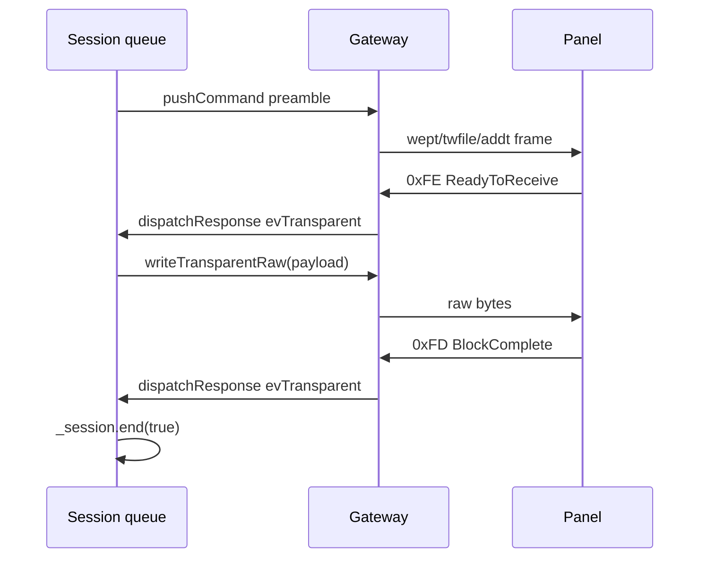
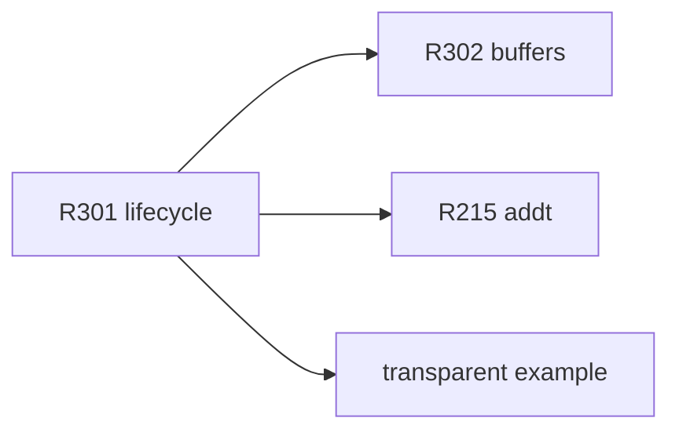

# TRANSPARENT PROTOCOL — backlog и TODO

Спецификация и backlog для **Transparent Data Mode** (NIS §1.16) и связанного API `*_t` / `addt`.

**Связанные документы:** [REFACTORING_REWORKED.md](REFACTORING_REWORKED.md) (отсылка), [smartApp/IdMap.md](smartApp/IdMap.md).

**Статус:** **не готово к prod** — первый вызов `*_t` / `addt` **зависает очередь Session**.

---

## Модель протокола (NIS §1.16)

Типичная последовательность **TX transparent** (`wept`, `twfile`, `addt`):

1. MCU шлёт **преамбулу** обычной serial-командой (`0xFF×3`-terminated).
2. Панель отвечает **`0xFE` ReadyToReceive** (или ошибка status).
3. MCU шлёт **сырой payload** без заголовка Nextion (через `TxFramer::RawPayload`).
4. Панель отвечает **`0xFD` BlockComplete** (или fail status).
5. Session завершает транзакцию, очередь двигается дальше.

**RX transparent** (`rept`, `rdfile`): преамбула → панель шлёт raw bytes → MCU принимает в buffer → завершение кадром/событием.

| Kind | Преамбула (команды) | Payload | Завершение session |
|------|---------------------|---------|-------------------|
| `TransparentTx` | `wept`, `twfile`, `addt` | MCU → panel raw | `0xFD` / fail / timeout |
| `RawDataRx` | `rept`, `rdfile` | panel → MCU raw | byteCount / `0xFD` / timeout |

---

## Карта кода (что есть / чего нет)

| Модуль | Есть | Нет / stub |
|--------|------|------------|
| `nexCommands` | `writeT`/`readT`, `File::read`/`writeT`, `WaveForm::addT` serialize | — |
| `TxFramer` | `beginRaw`, `RawPayload` tick | orchestration из Session/Application |
| `Gateway` | `writeTransparentRaw` | RX raw mode, transparent session state |
| `RxFramer` / `TranslateMessage` | `0xFD`/`0xFE` → `msg::evTransparent` | приём произвольного raw block в buffer |
| `Session::pollTimeout` | — | `TransparentTx`/`RawDataRx` → `return false` (вечное ожидание) |
| `Application::dispatchResponse` | stub cases | `onTransparentEvent`, `_session.end`, raw RX |
| `Application::dispatchEvent` | `evTransparent` вне активной транзакции → `onTransparentEvent` | не при active transparent tx |
| Facades `AppEeprom` / `AppFileSystem` | enqueue преамбулы | `(void)buffer` — payload не передаётся |
| `waveform.hpp` | `addt` @experimental | TX buffer, `writeTransparentRaw` после `0xFE` |

---

## Backlog (ID)

### [ ] NEX-R301 — Lifecycle `TransparentTx` / `RawDataRx` (XL)

**Проблема (критично).** Facades и `addt` enqueue `Kind::TransparentTx` / `RawDataRx`. Session **никогда** не завершает tx:

- `Session::pollTimeout`: `case TransparentTx/RawDataRx: return false;`
- `Application::dispatchResponse`: stub → `return false`; очередь блокируется на head.

**Целевой pipeline (TX):**



**Задачи:**

1. **Session state** — подфаза transparent после `transmit()` преамбулы: `AwaitingReady` → `TxRaw` → `AwaitingComplete` (и зеркально для RX).
2. **`pollTimeout`** — отдельный timeout на каждую фазу (не общий get-response).
3. **`dispatchResponse`** — `evTransparent`: `ReadyToReceive` → trigger TX raw; `BlockComplete` → `end(true)`; fail status → `end(false)`.
4. **`RawDataRx`** — RX path: накопление `byteCount` байт в caller buffer (→ R302).
5. **Ошибки** — `TxBusyRaw`, timeout, `0xFE`/`0xFD` вне активной транзакции → `dispatchError` + `end(false)`.
6. **Не ломать** gate `txIdle` для обычных Command/Get (R106b отменён — gate корректен).

**Критерий готовности.** `write_t`/`read_t` round-trip на dedicated example; `pumpUntilIdle()` → `true` после transparent; queue drain.

| | |
|---|---|
| **Файлы** | `app/nexApplication.cpp`, `core/nexSession.cpp`, `core/nexGateway.*`, `core/nexMessages.hpp` |
| **Сложность** | XL |
| **Блокирует** | R302, R215, prod `*_t` |

---

### [ ] NEX-R302 — Buffer API в facades (XL)

**Проблема.** Сигнатуры facades уже принимают `buffer`, но реализация игнорирует его:

```cpp
// nexApplicationFacades.cpp
void AppEeprom::write_t(..., const uint8_t* buffer, ...) {
    (void)buffer;
    _app.enqueue(Transaction{cmd::Eeprom::writeT(...), ..., Kind::TransparentTx});
}
```

То же для `read_t`, `file_read_t`, `file_write_t`.

**Цель.**

1. Хранить `{ buffer, byteCount, offset }` в Transaction или side-struct до завершения tx (lifetime: caller держит buffer до `end`).
2. На `0xFE`: `Gateway::writeTransparentRaw(buffer, byteCount)`.
3. На RX: copy из RX framer/raw ring в `buffer`, decrement remaining.
4. Опционально: async callback `onTransparentComplete(bool ok, size_t n)` вместо блокирующего `enqueue`.

| | |
|---|---|
| **Файлы** | `app/nexApplicationFacades.*`, `core/nexSession.hpp`, `core/nexGateway.*` |
| **Сложность** | XL |
| **Зависит от** | NEX-R301 |

---

### [ ] NEX-R215 — Waveform `addt` (M stub / XL с R301)

**Проблема.** NIS: `addt id,ch,byteCount` + transparent payload samples. Сейчас — только преамбула, `@experimental` в `waveform.hpp`.

**Цель (варианты).**

1. **Полная реализация:** `addt(id, ch, const uint8_t* data, uint32_t n)` + R301 pipeline.
2. **Freeze:** `addt = delete` до R301; README «использовать `add` для streaming».

| | |
|---|---|
| **Файлы** | `comp/resources/waveform.hpp`, `core/nexCommands.hpp` |
| **Зависит от** | NEX-R301, R302 |

---

## TODO в коде (чеклист)

Отмечать `[x]` по мере закрытия.

### Session / Application

- [ ] `core/nexSession.cpp` — `pollTimeout`: фазы и timeout для `TransparentTx` / `RawDataRx`
- [ ] `app/nexApplication.cpp` — `dispatchResponse` `TransparentTx`: обработать `evTransparent`, вызвать `onTransparentEvent`, `_session.end`
- [ ] `app/nexApplication.cpp` — `dispatchResponse` `RawDataRx`: приём raw chunks, запись в buffer (R302)
- [ ] `app/nexApplication.cpp` — orchestration: после преамбулы `transmit()` → ждать `0xFE` → `writeTransparentRaw`
- [ ] `app/nexApplication.hpp` — документ `@experimental` на `onTransparentEvent`; контракт lifetime buffer
- [ ] `Transaction` — поля или attachment для transparent context (buffer ptr, remaining, phase enum)

### Gateway / Framer

- [ ] `core/nexGateway.cpp` — RX transparent mode: raw bytes не через обычный `RxFrame` (или отдельный collector)
- [ ] `core/nexGateway.hpp` — API: `beginTransparentRx(size_t n)`, `transparentRxIdle()`
- [ ] `core/nexMessages.hpp` — internal `evTransparent::Code` (timeout, cancelled, chunk) — комментарий «добавлять по мере необходимости»
- [ ] Согласовать `evTransparent` вне активной транзакции в `dispatchEvent` vs correlated в `dispatchResponse`

### Facades

- [ ] `app/nexApplicationFacades.cpp` — убрать `(void)buffer`; связать buffer с Transaction (R302)
- [ ] `app/nexApplicationFacades.hpp` — `@experimental` на `write_t`/`read_t`/`file_*_t` до R301

### Components

- [ ] `comp/resources/waveform.hpp` — `addt`: buffer + R301 или `= delete`
- [ ] Waveform `add` — уже NoAwaiting; **не путать** с `addt` (ordinary Command vs transparent)

### Tests / examples

- [ ] Dedicated example: EEPROM `wept`/`rept` или file `twfile`/`rdfile` round-trip
- [-] Mock `IByteStream` scripted `0xFE`/`0xFD` — [NEX-R402 DEFERRED](REFACTORING_DEFERRED.md); сейчас регрессия on-target
- [ ] Regression: после transparent `pumpUntilIdle()` → true

---

## Inventory API (все точки входа)

| API | Команда NIS | Kind | Buffer сегодня |
|-----|-------------|------|----------------|
| `AppEeprom::write_t` | `wept` | `TransparentTx` | ignored |
| `AppEeprom::read_t` | `rept` | `RawDataRx` | ignored |
| `AppFileSystem::file_write_t` | `twfile` | `TransparentTx` | ignored |
| `AppFileSystem::file_read_t` | `rdfile` | `RawDataRx` | ignored |
| `WaveformChannels::Channel::addt` | `addt` | `TransparentTx` (default) | нет параметра buffer |

Обычные **не-transparent** аналоги (`wepo`/`repo`, `delfile`, …) — `Kind::Command`, работают через Session.

---

## Правила до закрытия R301

1. **Не вызывать** `*_t` / `addt` из production firmware.
2. В заголовках — **`@experimental`** (facades, waveform).
3. PR — **отдельная ветка** (XL), после R106 ✓
4. При code review: любой новый transparent path должен завершать `_session.end`.

---

## Рекомендуемый порядок

1. **R301** — session phases + `dispatchResponse` + `pollTimeout` (minimal EEPROM TX)
2. **R302** — wire buffers в facades
3. **R215** — waveform `addt`
4. **Example on-target** — регрессия на железе + логи (mock UART — R402 DEFERRED)



---

## Журнал

| Дата | Событие |
|------|---------|
| 2026-06-20 | Создан TRANSPARENT_PROTOCOL.md; R301/R302/R215 и code TODO собраны из REMAINING/REWORKED |
